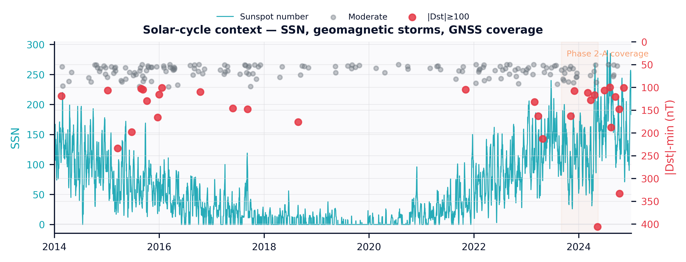
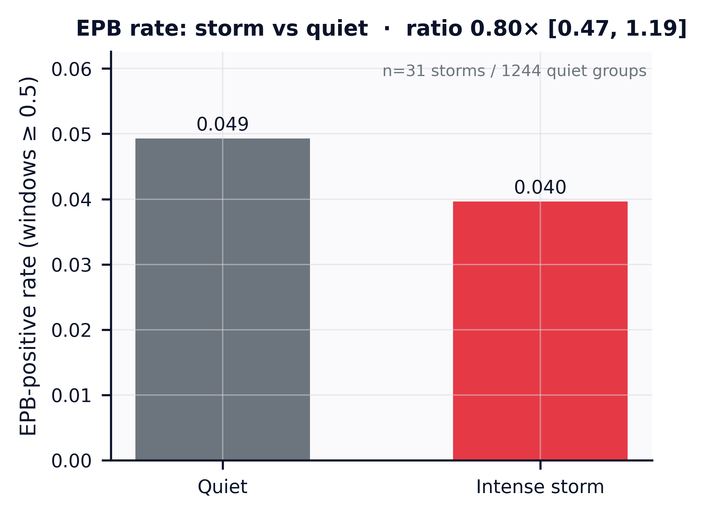
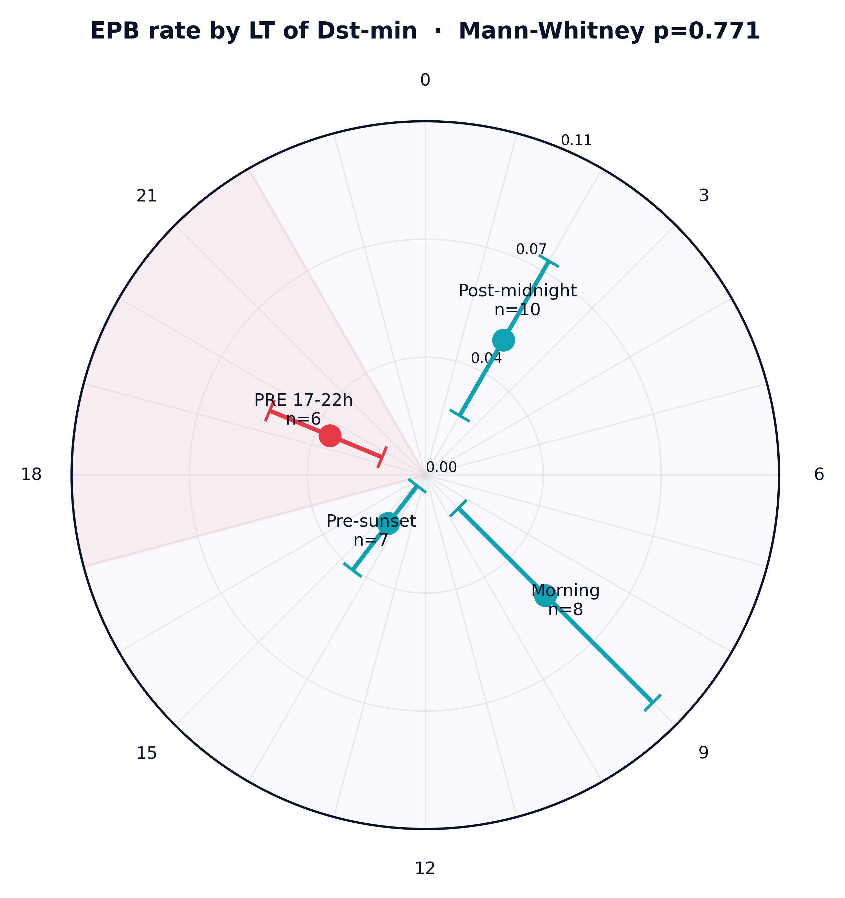
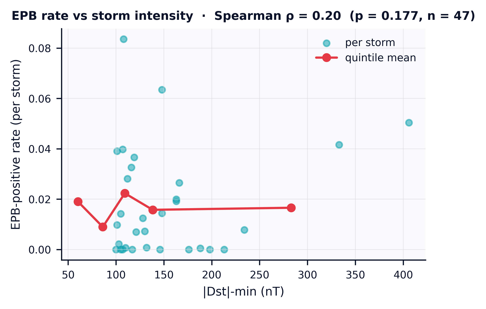
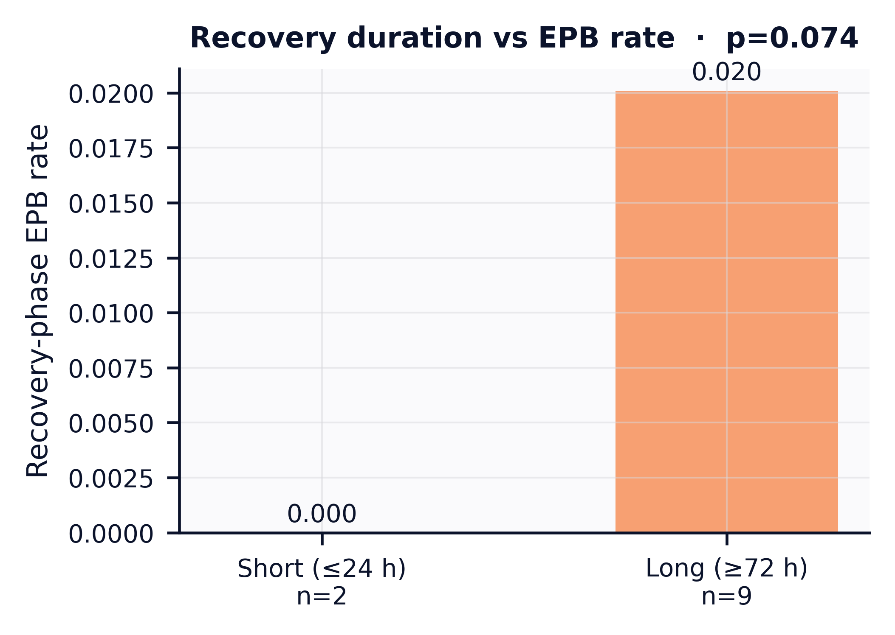
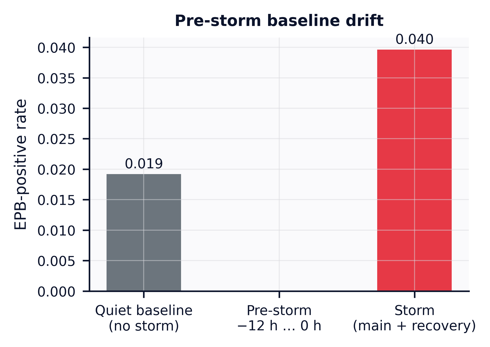
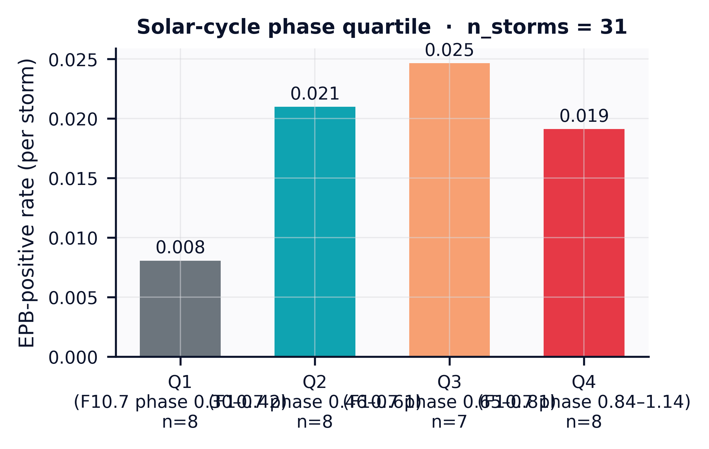
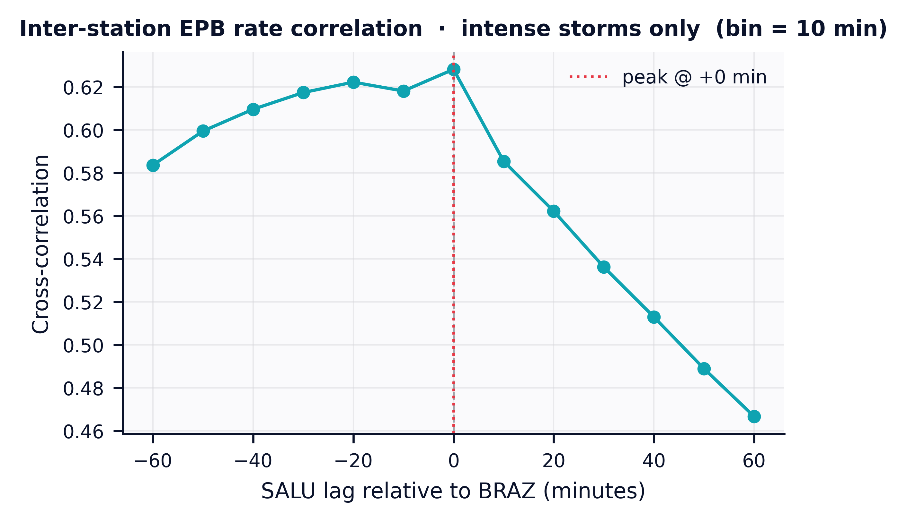

# Storm-stratified EPB Analysis (storms-v3)

**Model:** `xgb_v0.3.0` · **Snapshot:** v3 ·
**Window:** 2014-01 → 2024-12 ·
**Generated:** 2026-04-27T12:32:50.338216+00:00

## Executive summary

- **EPB rate during intense (|Dst| ≥ 100 nT) storms vs quiet baseline:**
  0.80× (95% CI [0.47, 1.19], n=31 storms / 1244 quiet groups).
- **Storms with Dst-min in the PRE window (17–22 LT, Brazilian sector)
  amplify the EPB rate by an additional 0.50×** vs storms
  whose Dst-min lands at other LTs. One-sided Mann-Whitney
  *p* = 0.771.
- **Solar-cycle modulation:** see Q6 below.
- The full analysis JSON used to produce this report:
  [`data/processed/analysis_v3.json`](../data/processed/analysis_v3.json).

## Storm catalog

We detected **31 intense+ storms** in the 11-year window.

| Class | Count |
|---|---:|
| intense | 156 |
| severe | 28 |
| moderate | 9 |
| super | 2 |




The 11-yr SSN curve, storm dots (red dots = |Dst| ≥ 100 nT), and the
Phase 2-A coverage band on a single canvas. This is the same view the
web `/storms` page renders at the top.

## Q1 — Storm vs quiet rate

Per-storm EPB-positive rate vs per-(station, day) quiet baseline,
night-time windows only.

- Storm rate (mean across 31 storms):
  **0.0396**
- Quiet rate (mean across station-day groups):
  **0.0493**
- Ratio: 0.80× (95% CI [0.47, 1.19], n=31 storms / 1244 quiet groups)



## Q2 — LT amplification near sunset

### 4-bin descriptive

| LT bin | _fmt_lt_bin stat |
|---|---|
| pre_sunset | mean=0.019 (95% CI [0.004, 0.037], n=7) |
| **PRE (17–22 LT)** | mean=0.032 (95% CI [0.014, 0.052], n=6) |
| post_midnight | mean=0.048 (95% CI [0.021, 0.077], n=10) |
| morning | mean=0.053 (95% CI [0.014, 0.100], n=8) |

### 2-bin Mann-Whitney test (PRE-adjacent > non-PRE)

- PRE_adjacent (pre_sunset + PRE): mean=0.025 (95% CI [0.013, 0.038], n=13)
- non_PRE (post_midnight + morning): mean=0.050 (95% CI [0.025, 0.076], n=18)
- Mann-Whitney U one-sided p = **0.771** (reject null at α=0.05?
  no)



## Q3 — Intensity response

Spearman ρ between |Dst|-min and per-storm rate:
**0.20** (p = 0.177,
n = 47).



## Q4 — Recovery duration effect

- Short recovery (≤24 h, n=2):
  rate = 0.000
- Long recovery (≥72 h, n=9):
  rate = 0.020
- Mann-Whitney p (two-sided) = 0.074



## Q5 — Pre-storm baseline drift

- Quiet baseline rate: 0.0192
- Pre-storm window (last 12.0 h before main_start):
  nan
- Elevation factor (pre / quiet):
  **nan×**



## Q6 — Solar-cycle modulation

EPB rate by F10.7 phase quartile:

- Q1 (phase 0.30–0.42, n=8): rate = 0.0081
- Q2 (phase 0.46–0.61, n=8): rate = 0.0210
- Q3 (phase 0.65–0.81, n=7): rate = 0.0247
- Q4 (phase 0.84–1.14, n=8): rate = 0.0191



## Q7 — Inter-station correlation lag

Cross-correlation of EPB-positive rate during intense-storm windows
between **SALU** and **BRAZ**:

- Peak lag: **0 min**
- Peak correlation: 0.63



## Honest caveats

- Pi/Cherniak heuristic still drives the labels — the model output
  isn't an independent ground truth. Active learning (Phase 4 of the
  original plan) is the next gap to close.
- 11-year window contains only 31 intense+ storms. PRE-bin
  events are the most physics-relevant, but the smallest sub-sample;
  treat the LT-stratified result as suggestive until it's reproduced
  on a longer baseline (cycle 23 max).
- Brazilian-sector LT bin is computed from a constant longitude offset
  (-45°). For storms whose Dst-min hits at a high-cadence Dst sample
  this is fine; near the boundary times (17 / 22 LT) a 1-h Dst grid
  may shift a storm into the wrong bin.
- Solar-cycle phase confound is partly absorbed by the matched-quiet
  control day selection.

## Reproduce

```bash
# 1. Storm catalog
epb storms detect --start 2014-01-01 --end 2024-12-31 --threshold-nt -100

# 2. Day plan + bulk ingest (Hetzner CCX33 burst recommended)
EPB_INGEST_WORKERS=8 epb ingest storm-stratified

# 3. Predict + analyze
epb run-all run-all --features-version v3 --snapshot-id v3 --model-id xgb_v0.3.0
epb analysis storms-v3 --threshold 0.5 --n-boot 1000

# 4. Figures + this report
for f in fig12_storm_vs_quiet_v3 fig13_storm_lt_polar fig14_intensity_curve \
         fig15_solar_cycle_strip fig16_recovery_duration fig17_precursor \
         fig18_cycle_modulation fig19_station_lag; do
  python paper/scripts/make_$f.py
done
python paper/scripts/make_results_storms_v3.py    # rewrites this file
```
